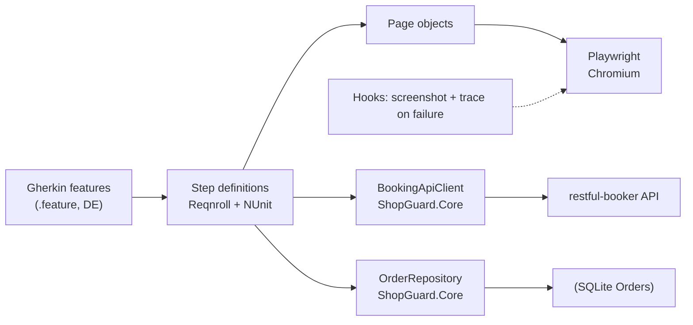
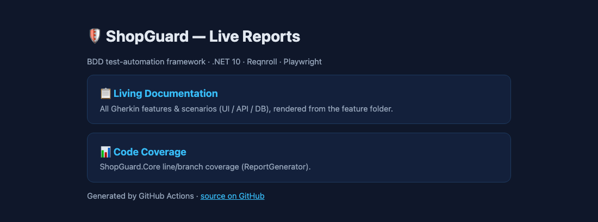
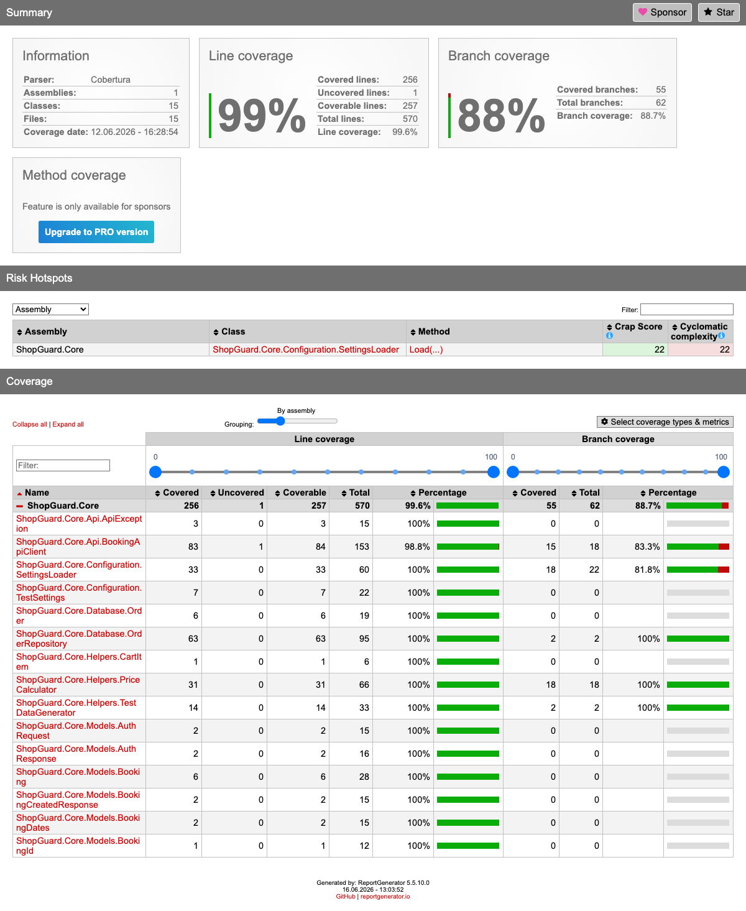
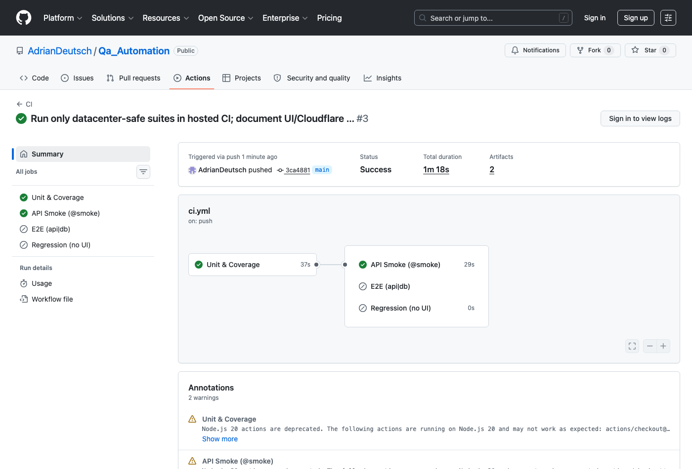
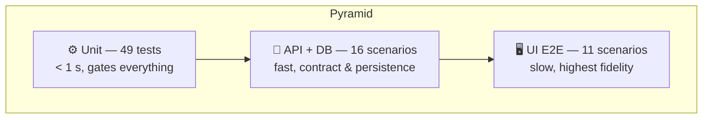

<p align="center">
  
</p>

<p align="center">
  <a href="https://github.com/AdrianDeutsch/Qa_Automation/actions/workflows/ci.yml"></a>
  
  <a href="https://adriandeutsch.github.io/Qa_Automation/"></a>
  
  
  
  <a href="LICENSE"></a>
</p>

<p align="center">
  
  <br><em>A real end-to-end run: login → product search → cart → checkout with order confirmation</em>
</p>

**ShopGuard** is a behaviour-driven test-automation framework for a demo web shop and a REST API.
It combines Gherkin scenarios (Reqnroll) with Playwright UI tests, a typed API client and SQL database
validation. Every layer runs **green in CI** — including the full UI suite, executed against a
self-hosted instance of the shop — and the results are published as a clickable
[**live report**](https://adriandeutsch.github.io/Qa_Automation/).

> 🇩🇪 The Gherkin scenarios are written in German (the project's domain language); all code and comments are in English.

---

## 📑 Table of contents

- [Highlights](#-highlights)
- [Features](#-features)
- [Architecture](#-architecture)
- [Live reports & screenshots](#-live-reports--screenshots)
- [Quick start](#-quick-start)
- [Test strategy](#-test-strategy)
- [Running UI tests in CI (self-hosted shop)](#-running-ui-tests-in-ci-self-hosted-shop)
- [Project structure](#-project-structure)
- [CI/CD pipeline](#-cicd-pipeline)
- [Defect management](#-defect-management)
- [Bonus: Playwright with TypeScript](#-bonus-playwright-with-typescript)

---

## ⭐ Highlights

- **Full test pyramid runs green in cloud CI** — 49 unit tests, 16 API/DB scenarios, 11 UI scenarios.
- **UI E2E runs in the cloud, not just locally** — a nightly/on-demand CI job spins the shop up via
  Docker, builds it, and runs the full Playwright suite against it, side-stepping the Cloudflare bot-wall
  on the public demo (no bot-evasion). The fast push pipeline stays green in ~1–2 minutes.
- **99.6 % line coverage** on the reusable core, enforced and reported every push.
- **Clickable live documentation** (BDD scenarios + coverage) auto-deployed to GitHub Pages.
- **Fail-fast pyramid**: unit tests gate everything; no browser starts if they are red.
- **Failure forensics**: screenshot + Playwright trace captured automatically and uploaded as CI artifacts.

---

## ✨ Features

| Area | Status | Technology |
|---|---|---|
| ✅ UI E2E tests (11 scenarios) | green (nightly CI + local) | Playwright for .NET, Page Object Model |
| ✅ API tests (14 scenarios) | green in CI | Typed `HttpClient` client against restful-booker |
| ✅ Unit tests (49 tests, < 1 s) | green in CI | NUnit 4 + Moq, mocked `HttpMessageHandler` |
| ✅ SQL validation (2 scenarios) | green in CI | SQLite + Dapper, ANSI-compatible schema |
| ✅ Code coverage ≥ 80 % | 99.6 % | Coverlet + ReportGenerator |
| ✅ CI/CD with tag selection | live | GitHub Actions (+ portable `.gitlab-ci.yml`) |
| ✅ Living documentation + coverage | published | GitHub Pages |
| ✅ Screenshots + traces on failure | active | Playwright tracing, CI artifacts |

**Targets:** UI against the [Toolshop](https://practicesoftwaretesting.com) (stable `data-test` selectors),
API against [restful-booker](https://restful-booker.herokuapp.com).

---

## 🏗 Architecture



Reusable logic (API client, price calculation, test-data generator, config loader, order repository)
lives in `ShopGuard.Core` and is fully unit-tested — the E2E layer stays thin.

---

## 📊 Live reports & screenshots

**▶ Live report (GitHub Pages):** https://adriandeutsch.github.io/Qa_Automation/ — browsable BDD
living documentation + the full coverage report, refreshed on every push to `main`.


<br><em>Live report hub on GitHub Pages: Living Documentation (BDD scenarios) + coverage</em>


<br><em>Coverage report (ReportGenerator): 99.6 % line coverage for ShopGuard.Core</em>


<br><em>Green CI pipeline (GitHub Actions): unit → API + UI → Pages, fail-fast pyramid</em>

> On a failed UI scenario the pipeline uploads a full-page **screenshot** and a **Playwright trace**
> as job artifacts (open with `playwright show-trace <trace.zip>`). Defect reports following a Jira
> template live in [docs/defects/](docs/defects/).

---

## 🚀 Quick start

1. **Clone & build**
   ```bash
   git clone https://github.com/AdrianDeutsch/Qa_Automation.git && cd Qa_Automation
   dotnet build ShopGuard
   ```
2. **Install the Playwright browser** (once)
   ```bash
   dotnet tool install --global Microsoft.Playwright.CLI
   pwsh ShopGuard/ShopGuard.E2ETests/bin/Debug/net10.0/playwright.ps1 install chromium
   ```
3. **Run the unit tests** (< 1 second)
   ```bash
   dotnet test ShopGuard/ShopGuard.UnitTests
   ```
4. **Run the API + DB suite**
   ```bash
   dotnet test ShopGuard/ShopGuard.E2ETests --filter "TestCategory=api|TestCategory=db"
   ```
5. **Run the UI suite** against your own Toolshop (no Cloudflare):
   ```bash
   docker compose -f docker/toolshop.compose.yml up -d
   docker compose -f docker/toolshop.compose.yml exec -T laravel-api php artisan migrate:fresh --seed --force
   SHOPGUARD_ENV=selfhosted dotnet test ShopGuard/ShopGuard.E2ETests --filter "TestCategory=ui"
   ```
   Watch the browser live with `HEADLESS=false`.

---

## 🎯 Test strategy



**Tagging** (Reqnroll tags → NUnit categories → `--filter "TestCategory=..."`):

| Tag | Meaning | Where it runs |
|---|---|---|
| `@smoke` | critical path, fast | every push |
| `@ui` / `@api` / `@db` | layer selection | every push / PR |
| `@regression` | full set | nightly schedule |
| `@e2e` | complete order flow | PR + nightly |
| `@wip` | in progress / unstable ([FLAKY-TESTS.md](FLAKY-TESTS.md)) | nowhere |

---

## 🐳 Running UI tests in CI (self-hosted shop)

Both public demo shops (originally demo.nopcommerce.com, now the Toolshop) sit behind a **Cloudflare
bot challenge** that triggers for data-center IPs such as GitHub-hosted runners. Instead of evading
the protection, the pipeline **hosts the shop itself**: [docker/toolshop.compose.yml](docker/toolshop.compose.yml)
brings up the Toolshop's prebuilt images (Angular UI + Laravel API + MariaDB), seeds the database, and
the UI tests run against `http://localhost:4200` via the `selfhosted` environment.

The shop is served as a **production build** (the Vite dev server is too slow per fresh browser context
on CI runners), which renders instantly. Because building it in-container takes ~15–20 minutes, this job
runs **nightly and on demand** (`workflow_dispatch`) rather than on every push — the push pipeline stays
green in ~1–2 minutes. Locally you can run the UI suite any time with the Quick-start commands above.

This is the same pattern you'd use for a real product: test against a disposable, seeded instance you
control — deterministic data, no external flakiness, no third-party rate limits.

---

## 📁 Project structure

```
Qa_Automation/
├── ShopGuard/
│   ├── ShopGuard.Core/          # Reusable: ApiClient, helpers, models, OrderRepository
│   ├── ShopGuard.UnitTests/     # 49 NUnit tests, Moq-mocked HttpMessageHandler
│   └── ShopGuard.E2ETests/
│       ├── Features/
│       │   ├── UI/              # Login, cart, search, checkout (Gherkin, DE)
│       │   └── API/             # Booking CRUD, auth, negative tests, DB validation
│       ├── StepDefinitions/     # Bindings — thin, logic lives in Pages/Core
│       ├── Pages/               # Page Object Model (data-test selectors)
│       ├── Database/            # SQL schema + scenario-scoped DB context
│       ├── Hooks/               # Browser lifecycle, screenshot + trace on failure
│       ├── Support/             # Settings, PlaywrightDriver, ScenarioState
│       └── reqnroll.json
├── playwright-ts/               # Bonus: UI scenarios ported to Playwright Test (TypeScript)
├── docker/toolshop.compose.yml  # Self-hosted shop under test (for UI in CI)
├── docs/
│   ├── defects/                 # Defect reports following a Jira template
│   ├── JIRA-BUG-TEMPLATE.md
│   └── images/
├── FLAKY-TESTS.md               # Detecting & handling flaky tests
├── .github/workflows/ci.yml     # Live pipeline (GitHub Actions)
└── .gitlab-ci.yml               # Equivalent GitLab variant (stages, tags, Pages)
```

---

## 🔁 CI/CD pipeline

The pipeline runs live on **GitHub Actions** ([ci.yml](.github/workflows/ci.yml)); a fully equivalent
**[.gitlab-ci.yml](.gitlab-ci.yml)** (stages, tag selection, GitLab Pages) ships alongside it.

<details>
<summary><b>Jobs & triggers</b> (click to expand)</summary>

| Job | Trigger | Content | Notes |
|---|---|---|---|
| `unit` | every push | 49 unit tests + coverage | **fail-fast** — red ⇒ nothing else runs |
| `api` | needs unit | `@api` + `@db` | restful-booker + SQLite, retry on flakiness |
| `ui` | nightly + manual | `@ui` via self-hosted Toolshop | Docker compose + prod build (~15–20 min) |
| `pages` | push to `main` | Living doc + coverage → GitHub Pages | published report |
| `regression` (GitLab) | nightly | full set | scheduled |

</details>

---

## 🐞 Defect management

Three real, documented defects (template: [JIRA-BUG-TEMPLATE.md](docs/JIRA-BUG-TEMPLATE.md)):

| ID | Component | Summary | Root cause |
|---|---|---|---|
| [DEFECT-001](docs/defects/DEFECT-001.md) | API | `POST /booking` returns **418** instead of 4xx without an Accept header | product bug |
| [DEFECT-002](docs/defects/DEFECT-002.md) | API | `POST /auth` returns **200** for invalid credentials | product bug |
| [DEFECT-003](docs/defects/DEFECT-003.md) | UI | Checkout blocked: house number from registration missing in profile | product bug |

Workflow: failure analysis (trace/logs) → classification (product / test / flaky) → report → fix or workaround → retest.

---

## 🎁 Bonus: Playwright with TypeScript

Selected UI scenarios are also ported to **Playwright Test (TypeScript)** — same Page Object structure,
same `data-test` selectors:

```bash
cd playwright-ts
npm install && npx playwright install chromium
npx playwright test
```
